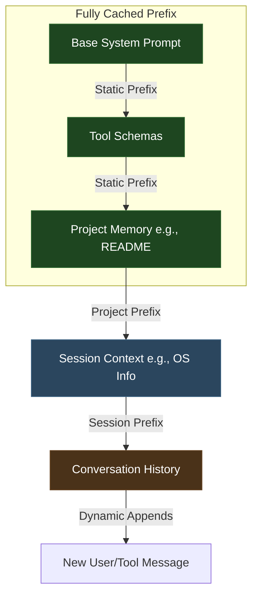
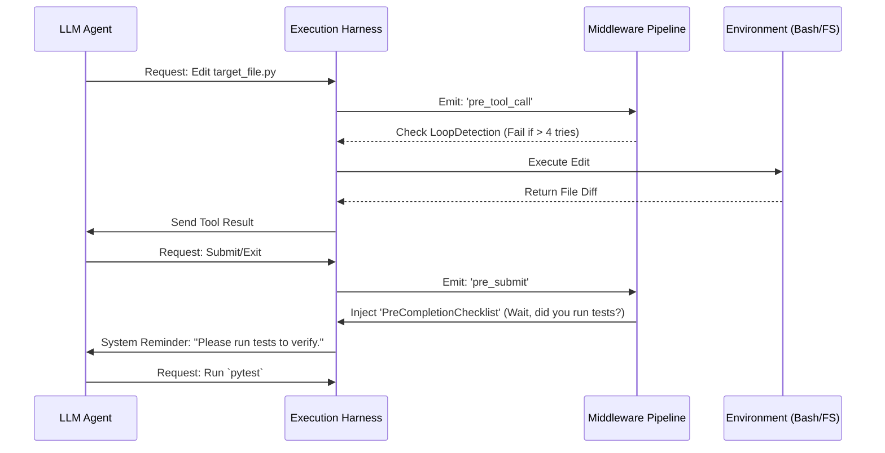

# Initial Implementation Plan

## Phase 1: Context Engine & Caching Layer

Build a structured Prompt Builder that strictly enforces the Prefix Matching patterns so every task in a session enjoys a >90% cache hit rate.

## Phase 2: Interoperable Tooling & Lazy Loading

Implement tools as immutable objects for the session. Implement "Plan Mode" to alter agent rules without unloading tool schemas.

- Define core tools: `read_file`, `write_file`, `bash_command`.
- Implement dummy/stub tools for complex integrations.
- Implement "Cache-Safe Forking" for compaction.

## Phase 3: The Middleware Harness

Implement pre-completion checks and loop detection via a middleware pipeline.

## Phase 4: Tracing & Feedback Loop

Build an automated pipeline that sends JSON traces of failed agent runs into an evaluation database.

- Hook LLM API calls to save traces.
- Implement `TraceAnalyzer` subagent to review failures.
