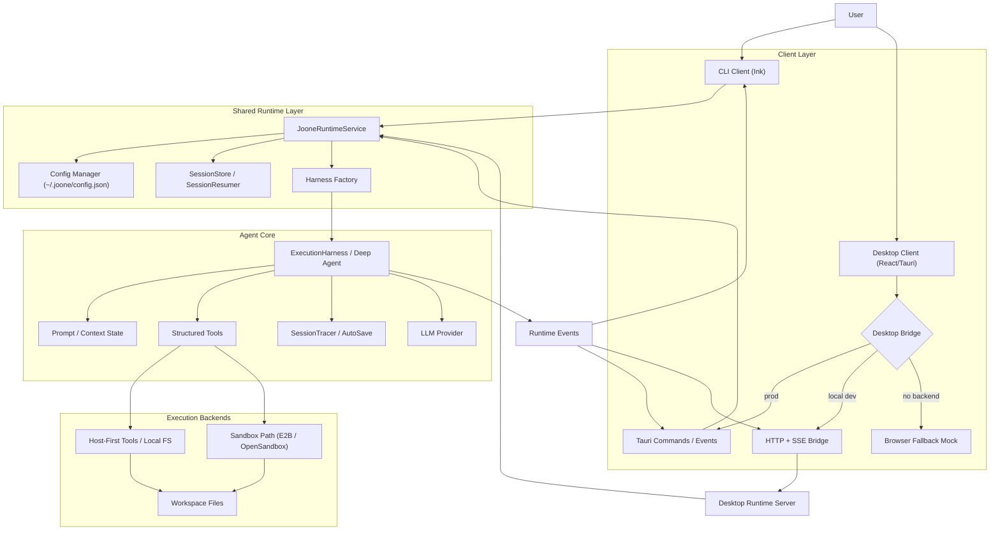

# System Architecture

## High-Level Architecture Overview

Joone is no longer just a CLI-first REPL. The current architecture is now **multi-client**:

- the existing **CLI/TUI client** (`joone start`) remains supported
- the new **desktop client path** is being built on top of the same Node runtime
- both clients share the same **agent core**, session model, and config store

The key architectural shift in Milestone 20 is the introduction of a **shared runtime service** that sits between UI clients and the Deep Agents execution engine.

## Current Runtime Model

At a high level:

1. A client starts or resumes a session
2. The client talks to the shared runtime service
3. The runtime prepares config, session state, and `ExecutionHarness`
4. The harness runs the Deep Agent loop and emits stream/tool/status events
5. The client renders those events as chat, metrics, and activity

For the desktop path, there are currently three frontend/runtime modes:

- **Tauri bridge**: the intended end-state, where the desktop UI talks to Tauri commands/events
- **HTTP bridge**: a local development path where the desktop UI talks to a Node dev server over HTTP + SSE
- **Browser fallback**: a mock bridge used only when neither Tauri nor the local runtime server is present

The **browser fallback** means the desktop UI can still render and behave like an app shell during frontend work, even if no backend runtime is attached yet. It does **not** run the real agent. It returns mock config/session data so UI work can proceed independently.

## Multi-Client Diagram



## Desktop Development Modes

### 1. Browser fallback

- Implemented in `desktop/src/bridge/browserBridge.ts`
- Used when the desktop shell is opened without Tauri and without `VITE_JOONE_DESKTOP_API_URL`
- Purpose: unblock desktop UI development
- Limitation: does not run the real runtime or agent loop

### 2. Runtime-backed HTTP dev mode

- Implemented by `src/desktop/server.ts` and `src/desktop/devServer.ts`
- The desktop shell points at the runtime server via `VITE_JOONE_DESKTOP_API_URL`
- Purpose: enable local desktop frontend work against the real Node runtime before full Tauri command wiring is finished
- Transport:
  - HTTP for config/session/message actions
  - Server-Sent Events for streamed runtime events

### 3. Tauri mode

- Intended production architecture
- The desktop shell uses `@tauri-apps/api` to call native commands and subscribe to emitted events
- Current native coverage:
  - startup status/config
  - saved session listing
  - session start/resume
  - message submission
  - live session event subscription via native Tauri events relayed from the runtime SSE stream
- Remaining HTTP-backed Tauri paths are now limited to the small set of lifecycle actions that have not migrated yet, such as `closeSession()` and `saveConfig()`
- This will replace the browser fallback as the primary desktop runtime path once Milestone 20 is complete

## Hybrid Sandbox Model

Joone still favors a **Host-First Architecture** combined with Deep Agents orchestration:

- **File operations** (`write_file`, `read_file`) and whitelisted shell execution default to the **host machine**
- **Sandbox execution** remains available through `executionMode: "sandbox"`
- A **File Sync** layer mirrors changed files from host to sandbox only when sandbox mode is active

```text
HOST MACHINE  --sync when needed-->  SANDBOX (/workspace mirror)

Host:
- read_file
- write_file
- host-first shell/backend work

Sandbox:
- isolated command execution
- tests / installs / dangerous workloads
```

## Component Breakdown

1. **Client Layer**
   - `src/cli/index.ts`: CLI entrypoint and Ink app launcher
   - `desktop/src/App.tsx`: desktop shell UI
   - `desktop/src/bridge/*`: desktop runtime selection and adapters

2. **Shared Runtime Layer**
   - `src/runtime/service.ts`: reusable session/config/runtime orchestration for all clients
   - `src/runtime/types.ts`: normalized runtime event and session contracts
   - `src/desktop/ipc.ts`: desktop-facing runtime bridge contract for the Tauri path
   - `src/desktop/server.ts`: HTTP/SSE server for local desktop development

3. **Execution Engine**
   - `src/core/agentLoop.ts`: `ExecutionHarness` backed by Deep Agents and LangGraph primitives
   - `src/core/promptBuilder.ts`: state/prompt composition
   - `src/core/contextGuard.ts`: context safety and token boundaries

4. **Persistence and Recovery**
   - `src/core/sessionStore.ts`: saved sessions
   - `src/core/sessionResumer.ts`: resume wakeup + drift detection
   - `src/core/autoSave.ts`: periodic persistence

5. **Observability**
   - `src/tracing/sessionTracer.ts`: token/tool/cost tracing
   - runtime events normalized into session, token, tool, HITL, and completion events

6. **Execution Backends**
   - Host-first file and shell paths
   - sandbox path through E2B/OpenSandbox abstractions

## Event Flow

The normalized runtime event surface now targets both CLI and desktop consumers:

- `session:started`
- `session:state`
- `agent:token`
- `tool:start`
- `tool:end`
- `hitl:question`
- `hitl:permission`
- `session:error`
- `session:completed`

This event model is the architectural seam that allows the same runtime to power multiple clients.

## Current State vs End State

### Current

- CLI is fully functional
- shared runtime service exists
- desktop shell exists
- HTTP runtime-backed dev mode exists
- browser fallback exists for UI-only work
- Tauri production command/event wiring now covers startup, session lifecycle, message submission, and live runtime event subscription
- Tauri still has a small amount of transitional HTTP-backed behavior for unmigrated lifecycle/config actions

### End state for Milestone 20

- desktop shell talks to the real runtime through Tauri, not mock fallback
- desktop packaging works for `.msi`, `.dmg`, and `.AppImage`
- CLI and desktop remain two supported clients over the same runtime core
